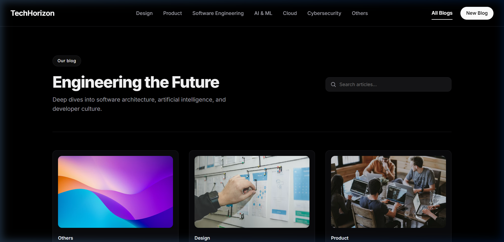
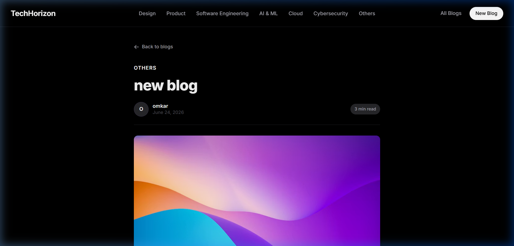
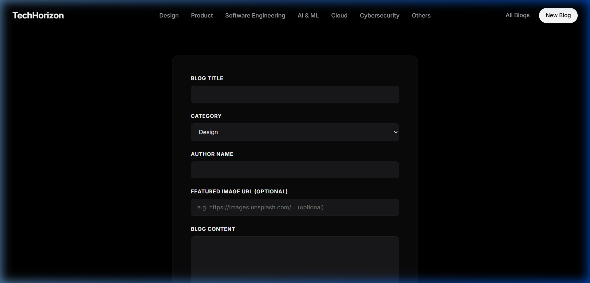

# TechHorizon

TechHorizon is a premium, minimalist dark-themed developer and engineering blog application. Built with a React client and a lightweight Node.js Express server, it features a sleek black-and-white aesthetic, responsive layout configurations, dynamic content reading metrics, and optimized production hosting options.

## 📸 Screenshots

### Blogs Landing Page (Two-Column Hero & Cards Grid)


### Cinematic Blog Reader Mode & Recommendations


### Automated New Blog Form


---

## 🚀 Key Features

* **Minimalist Tech Dark Aesthetic**: Curated zinc and pure black color scheme with clean border systems and Inter typography.
* **Responsive Category Filtering**: Centered desktop filters and a horizontally swipeable/scrollable pill navigation bar for mobile viewports.
* **Compact Grid Layout**: Responsive two-column grid on mobile screens to display cards compactly, and a clean, centered layout for large desktop monitors.
* **Cinematic Reader Mode**: A distraction-free publication layout set at an optimal reading width of `46rem` to maximize paragraph legibility.
* **Truncated Cards**: Grid descriptions automatically truncate at word boundaries with a bold "Read more" indicator, ensuring cards remain uniform.
* **Smart Article Publishing**:
  * **Auto-calculated Read Time**: Automatically estimates read time at a rate of 200 words per minute from the blog body content.
  * **Auto-selected Publish Date**: Pre-populates the current date for new articles or preserves the original date when editing.
  * **Optional Cover Image**: Automatically falls back to a high-quality abstract tech placeholder image if the featured URL is left blank.
  * **Hidden Inputs**: Automatically calculated publishing values are handled cleanly in the background and submitted via hidden fields.
* **Preserved Formatting**: Text articles utilize whitespace-preservation to correctly display paragraph layout breaks.

---

## 🛠️ Tech Stack

* **Frontend**: React (v19), React Router (v6), CSS Modules
* **Backend**: Node.js, Express, UUID, File-based local JSON database
* **Deployment**: Optimized for Vercel (Frontend SPA routing) and Render (Backend dynamic port binding)

---

## 📁 Project Structure

```text
react-practice-project-2/
├── backend/
│   ├── data/            # Local data access helpers
│   ├── routes/          # Express API endpoints
│   ├── app.js           # Server entry point (binds to process.env.PORT)
│   ├── blogs.json       # Database mock storage file
│   └── package.json
└── frontend/
    ├── public/          # HTML templates & brand logo assets
    ├── src/
    │   ├── components/  # React reusable components (List, Item, Form, Navigation)
    │   ├── pages/       # Page routing structures (Landing list, Details, Edit, Creation)
    │   ├── App.js       # Route paths configurations
    │   ├── index.js     # React root bootstrapper
    │   └── index.css    # Global stylesheet & design system tokens
    ├── vercel.json      # Vercel rewrite configuration for SPA client routing
    └── package.json
```

---

## 💻 Local Setup & Development

Follow these steps to run both the frontend and backend locally.

### 1. Prerequisites
Ensure you have [Node.js](https://nodejs.org/) installed.

### 2. Set Up the Backend
1. Navigate to the `backend` folder:
   ```bash
   cd backend
   ```
2. Install dependencies:
   ```bash
   npm install
   ```
3. Start the Express server:
   ```bash
   npm start
   ```
   The backend server will run on `http://localhost:8080`.

### 3. Set Up the Frontend
1. In a new terminal, navigate to the `frontend` folder:
   ```bash
   cd ../frontend
   ```
2. Install dependencies:
   ```bash
   npm install
   ```
3. Start the React development server:
   ```bash
   npm start
   ```
   The application will launch automatically in your browser at `http://localhost:3000`.

---

## 🌐 Production Deployment

This project is configured to be deployed as two decoupled services:

### 1. Backend (API Server) — e.g. on Render
- When deploying the `backend/` folder on **Render** as a Web Service:
  - Set **Root Directory** to `backend`.
  - Set **Build Command** to `npm install`.
  - Set **Start Command** to `npm start`.
  - Node.js will automatically bind to the dynamic port injected by Render via `process.env.PORT`.

### 2. Frontend (Single-Page Client) — e.g. on Vercel
- When deploying the `frontend/` folder on **Vercel**:
  - Set **Root Directory** to `frontend`.
  - Set **Framework Preset** to `Create React App`.
  - Under **Environment Variables**, add:
    - **Name**: `REACT_APP_BACKEND_URL`
    - **Value**: `https://your-deployed-backend-api.com` (your live Render URL)
  - Vercel will automatically read the `vercel.json` file inside `frontend/` and route all direct URL entries to `index.html` to keep client-side navigation functional.
